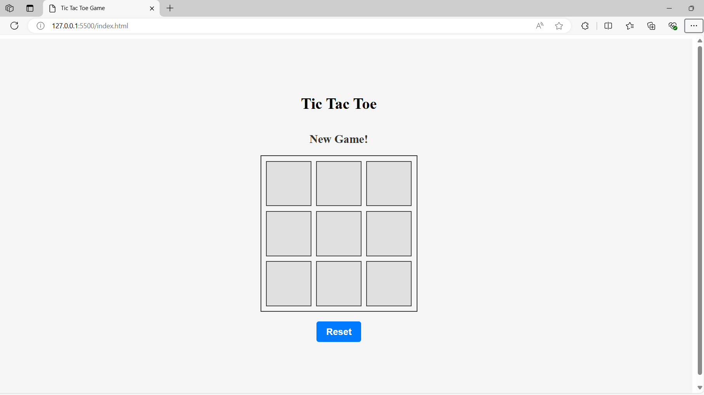

# Tic Tac Toe Game
A simple web-based implementation of the classic Tic Tac Toe game using HTML, CSS, and JavaScript. Enjoy playing against a friend or challenge yourself against the computer!
<!--
## Table of Contents

- [Screenshots](#screenshots)
- [Installation](#installation)
- [Usage](#usage)
- [Features](#features)
- [Technologies Used](#technologies-used)
- [Contributing](#contributing)
- [Credits](#credits)
- [License](#license)

## Screenshots



## Installation

To run this Tic Tac Toe game locally, follow these steps:

1. Clone the repository:
```
git clone https://github.com/anandyelloju/tic-tac-toe.git
```
2. Navigate to the project directory:
```
cd tic-tac-toe
```
3. Open the '**index.html**' file in your web browser to start playing.

## Usage

- Click on the grid to place your X or O.
- The game alternates turns between Player 1 (X) and Player 2 (O).
- The first player to get three of their symbols in a row (horizontally, vertically, or diagonally) wins.

## Features

- Play against a friend locally.
- Simple and intuitive user interface.
- Responsive design for various screen sizes.

## Technologies Used

- **HTML:** Markup language for creating web pages.
- **CSS:** Stylesheet language for designing web pages.
- **JavaScript:** Scripting language for making the game interactive.

[](https://skillicons.dev)

## Contributing

Contributions are welcome! If you have any suggestions or improvements.

## Credits

- Inspired by the classic Tic Tac Toe game.
- Developed by [Anand Yelloju](https://github.com/anandyelloju).

## License

This project is licensed under the [MIT License](https://choosealicense.com/licenses/mit/) - see the [LICENSE](https://github.com/your-username/tic-tac-toe/blob/main/LICENSE) file for details.
-->
